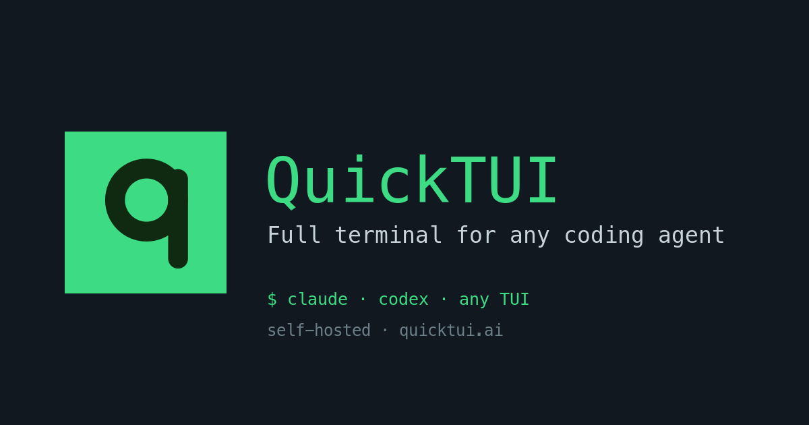

<p align="center">
  <a href="https://quicktui.ai">
    
  </a>
</p>

<h1 align="center">QuickTUI</h1>

<p align="center">
  <b>Full terminal for any coding agent — Claude Code, Codex, or any TUI.</b><br>
  Self-hosted, direct connection. Free for a single host.
</p>

<p align="center">
  <a href="https://apps.apple.com/app/quicktui/id6761338192">App Store</a> ·
  <a href="https://quicktui.ai">Website</a> ·
  <a href="https://discord.gg/DyJdXEa6q">Discord</a>
</p>

---

QuickTUI is the **iPhone, iPad, and browser** client for your own server. Kick off Claude
Code, Codex, or any long-running terminal job, then walk away — the session keeps running on
your machine (tmux under the hood), and you reattach from any screen, exactly where you left it.

## Why QuickTUI

- 📱 **Native iPhone & iPad app** + browser client — the same live session on every device
- 🖥️ **A real terminal, not a chat wrapper** — tmux windows, panes, scrollback, copy-mode
- 🤖 **Any CLI agent** — Claude Code, Codex, aider, or any TUI program
- 🔒 **Self-hosted, direct by default** — your code and API keys never touch our servers
- 📶 **Session keeper** — jobs survive disconnects, network changes, and app restarts
- 💸 **Free for one server** — Pro is a one-time purchase (unlimited servers); the only
  subscription is optional Relay, for when you can't connect directly

## Install the server (one line)

**macOS / Linux**

```sh
curl -fsSL https://quicktui.ai/q.sh | sh
```

**Windows (PowerShell)**

```powershell
irm https://quicktui.ai/q.ps1 | iex
```

Then pair the app by scanning `quicktui-server --qrcode`, or add your server manually by
URL + token. Requires tmux 3.2+ on the server (the installer can set it up for you).

## Get the app

- **App Store** — https://apps.apple.com/app/quicktui/id6761338192
- **Browser client** — served by your own server, nothing to install
- **Website & docs** — https://quicktui.ai
- **Community** — https://discord.gg/DyJdXEa6q

## About this repository

This repo hosts the QuickTUI **website and release distribution** (the `q.sh` / `q.ps1`
bootstrap, server manifests, and the static site at [quicktui.ai](https://quicktui.ai)).
QuickTUI is a commercial product; its application source is not open source. Questions or
bugs — open an issue or join the [Discord](https://discord.gg/DyJdXEa6q).
